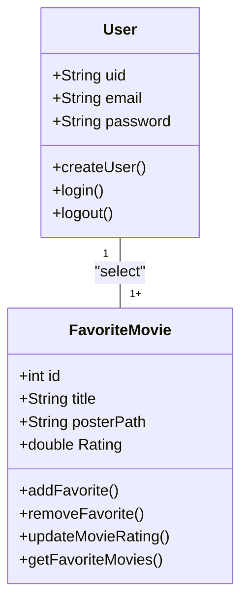
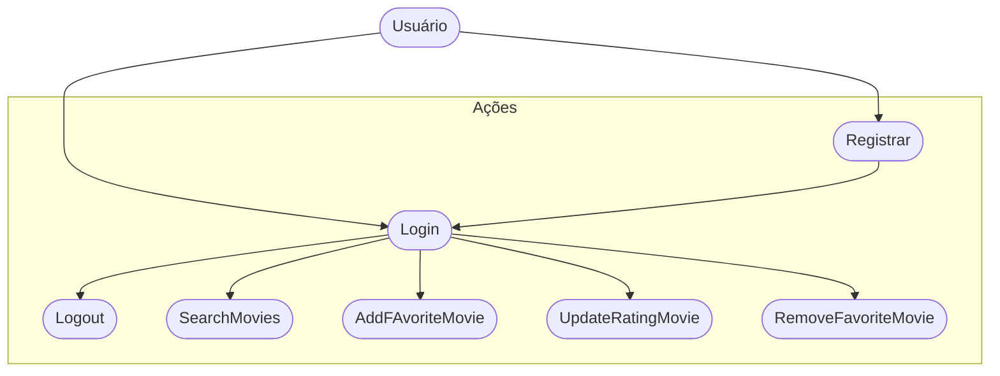
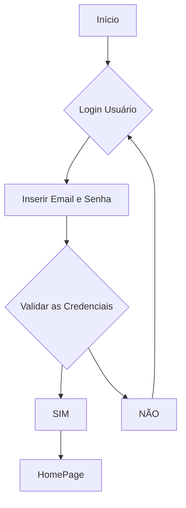

# formativa_cine_favorite
Construir um aplucativo do zero - O CineFavorite que permitirá criar uma conta e buscar filmes em uma API e montar uma galeria pessoal de filmes favoritos, com poster e nota avaliativa do usuário para o filme.

## Objetivos
- Criar uma galeria personalizada por usuário de filmes favoritos
- Conectar o APP com uma API(base de dados) de filmes (TMDB)
- Permitir a criação de contas para cada usuário 
- Listar filmes por uma palavra chave

## Levantamento de Requisitos
- ### Funcionais 

- ### Não Funcionais 

## Recursos do Projeto
- Linguagem de programação: Flutter/Dart
- API TMDB: Base de dados para filmes
- Firebase: Authentication/FireStore
- Figma: Prototipagem
- VSCode
- GitHub

## Diagramas 
1. Classe
Demonstar o funcionamento das entidades do sistema

- Usuário (User): classe já modelada pelo FirebaseAuth
    - Atributos: email, senha, uid
    - Métodos: login, registrar, logout

- Filmes Favoritos (FavoriteMovie): Classe modelada pelo DEV
    - Atributos: id, título, remover, listar, atualizadaNota (CRUD)

2. ### Uso
Ação que os atores podem fazer
- Usuário (User):
    - Registrar
    - Login
    - Logout
    - Procuraar filmes na API
    - Salvar filmes ao favoritos 
    - Dar nota aos filmes favoritos
    - Remover filmes favoritos 

3. ### Fluxo
Determina o caminho percorrido pelo ator para executar uma ação

- Fluxo de Ação de Login

## Prototipagem
Link dos protótipos

## Codificação

- Service --> Conectar com a API
- Model --> Favorite Movie 
- Controller -> Firestore DataBase - Incompleto
- View -> Registro, Login, FavoriteView, SearchView